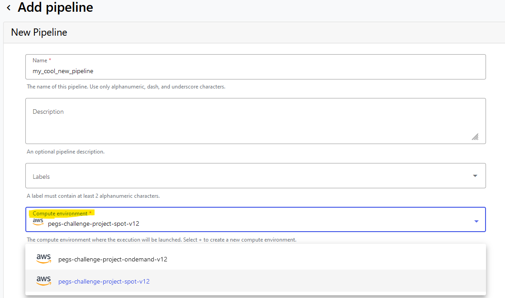

# py-optimize-nextflow
Python script for optimizing resource allocations for Nextflow workflows based on past 
metrics. This script has been packaged into a docker container so that it can be ran
anywhere.

### Running this container

#### Export the following environment variables to be used by the container:

Navigate to <https://tower.sagebionetworks.org/tokens> and obtain a new token for this
usage.

Replace the `TOWER_PROJECT_NAME`, and `WORKFLOW_RUN_ID` with the appropriate values for
the project/run you are reviewing.

```
export TOWER_ACCESS_TOKEN=<token>
export TOWER_API_ENDPOINT=https://tower.sagebionetworks.org/api
export TOWER_PROJECT_NAME=Sage-Bionetworks/ntap-add5-project
export WORKFLOW_RUN_ID=3a39HKtlv7C20a
```

#### Run the container:
```
docker run --rm \
-e TOWER_ACCESS_TOKEN=$TOWER_ACCESS_TOKEN \
-e TOWER_API_ENDPOINT=$TOWER_API_ENDPOINT  \
-e TOWER_PROJECT_NAME=$TOWER_PROJECT_NAME \
-e WORKFLOW_RUN_ID=$WORKFLOW_RUN_ID \
ghcr.io/sage-bionetworks-workflows/py-optimize-nextflow:v1.0.0 sh -c \
'tw --access-token $TOWER_ACCESS_TOKEN --url $TOWER_API_ENDPOINT --output "json" runs view -w $TOWER_PROJECT_NAME -i $WORKFLOW_RUN_ID metrics > metrics.json && python3 optimize-nextflow.py from-json metrics.json'
```

# Developers
## Building the docker image for GHCR
```
# Step 1: Authenticate with GHCR
echo $GITHUB_TOKEN | docker login ghcr.io -u USERNAME --password-stdin

# Step 2: Build the Docker image
docker build -t ghcr.io/sage-bionetworks-workflows/py-optimize-nextflow:latest .

# Step 3: Push the Docker image to GHCR
docker push ghcr.io/sage-bionetworks-workflows/py-optimize-nextflow:latest
```


# Reducing Compute Costs for Nextflow Pipelines on AWS guidelines

Developing Nextflow pipelines for scientific research and software engineering can be computationally intensive and expensive, especially when running on cloud platforms like AWS. However, there are several strategies you can employ to optimize costs without sacrificing performance.

### Utilize Spot Compute Instances

Spot instances are a cost-effective solution for running Nextflow pipelines. These instances can be up to 90% cheaper than on-demand instances. However, there's a tradeoff: spot instances are typically reclaimed after 6-8 hours, which can interrupt long-running tasks. 

**Best Practice:** Use spot instances for short and intermediate steps within your workflow. If a step in your workflow exceeds the typical spot instance duration (6-8 hours), it's better to use on-demand instances for that step. This ensures that you won't lose progress and incur additional costs from having to rerun long tasks.

### Optimize Memory and CPU Allocation

Properly allocating memory and CPU resources is essential for cost optimization. Over-provisioning resources can lead to unnecessary expenses, while under-provisioning can result in slower performance and potential failures.

**Best Practice:** Review the documentation for your specific workflow to determine the initial recommendations for memory and CPU allocation. Adjust these settings based on the workflow's requirements and monitor the performance to make further adjustments if necessary.

### Utilize the "optimize-nextflow" Project

After running your workflow, leverage the "optimize-nextflow" project to analyze your runs. This tool provides suggestions for the appropriate CPU and memory settings for future runs, helping you to fine-tune your resource allocation.

**Best Practice:** Regularly use "optimize-nextflow" to review your workflow runs. Implement the suggested optimizations to ensure you are using resources efficiently, which can lead to significant cost savings over time.

## How-to

### Set your compute environment to spot

#### Creating the pipeline through the UI
When you are creating a new pipeline for your project through the web UI you have an
option to set the Compute environment. Consider setting it to the `spot`
environment if you are able.



#### Launching a workflow through the py-orca project
<https://github.com/Sage-Bionetworks-Workflows/py-orca> is a python package for 
connecting services and building data pipelines orchestrated through Apache Airflow. 

<https://github.com/Sage-Bionetworks-Workflows/orca-recipes/blob/main/dags/nf-hello-test.py>
contains an example of creating an Airflow DAG that kicks off a nextflow workflow.
You'll see that `"tower_compute_env_type": Param("spot", type="string")` in this script
is set to `spot`.

### Adjust memory on memory related failures
If you have nextflow processes that have wildly different memory requirements you may
kick off a pipeline that is destined to fail. Use the following within your
`.config` file to automatically retry the task and adjust the memory on each failure:

```
process {
  withName: my_task_name {
      maxErrors     = '-1'
      maxRetries    = 3
      errorStrategy = { task.attempt <= 3 ? 'retry' : 'finish' }

      cpus   = 2
      memory = { adj_mem( task, [2.GB] ) }
  }
}


def adj_mem(task, progression) {
    def n_attempts = task.attempt
    if ( task.exitStatus ) {
        // Only increase memory if error was memory-related
        def memory_exit_codes = [104, 134, 137, 139, 143, 247]
        if ( memory_exit_codes.contains(task.exitStatus) ) {
            n_attempts = task.attempt
        } else {
            n_attempts = task.attempt - 1
        }
    }

    if ( n_attempts <= progression.size() ) {
        return progression[n_attempts - 1]
    } else {
        diff = n_attempts - progression.size()
        return progression.last() * Math.pow(2, diff)
    }
}
```
